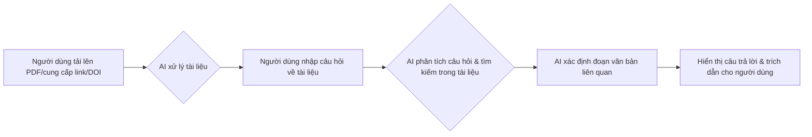

# Kế hoạch và Thiết kế Ứng dụng: MedResearch AI Chat

## 1. Tên ứng dụng

MedResearch AI Chat

## 2. Mục tiêu

Ứng dụng này nhằm mục đích hỗ trợ các nhà nghiên cứu y khoa, sinh viên y khoa, bác sĩ và các chuyên gia y tế khác trong việc:

*   Tìm kiếm thông tin từ các nguồn tài liệu y khoa uy tín (như PubMed, Google Scholar, arXiv) một cách nhanh chóng.
*   Tóm tắt nội dung chính của các bài báo nghiên cứu phức tạp.
*   Phân tích và so sánh thông tin giữa các nghiên cứu.
*   Trả lời các câu hỏi chuyên môn dựa trên bằng chứng từ tài liệu tham khảo.
*   Trích xuất dữ liệu cụ thể (ví dụ: liều lượng thuốc, phương pháp điều trị, kết quả thử nghiệm).

Qua đó, giúp người dùng tiết kiệm thời gian, nâng cao hiệu quả nghiên cứu và cập nhật kiến thức y khoa.

## 3. Đối tượng người dùng mục tiêu

*   Nhà nghiên cứu y khoa
*   Bác sĩ lâm sàng
*   Sinh viên các ngành Y, Dược, Sinh học
*   Dược sĩ
*   Các chuyên gia y tế cần tra cứu thông tin chuyên sâu

## 4. Các chức năng chính và tính năng cụ thể

### Chức năng chính:

*   **Tìm kiếm tài liệu y khoa (Medical Literature Search):** Tìm kiếm bài báo, nghiên cứu dựa trên từ khóa, chủ đề, tác giả, DOI.
*   **Tóm tắt thông minh (Intelligent Summarization):** Tóm tắt bài báo, tài liệu theo yêu cầu độ dài hoặc các phần cụ thể.
*   **Hỏi đáp dựa trên ngữ cảnh (Contextual Q&A):** Trả lời câu hỏi về nội dung tài liệu được cung cấp hoặc chủ đề y khoa chung.
*   **So sánh nghiên cứu (Study Comparison):** So sánh phương pháp, kết quả, kết luận giữa nhiều bài báo.
*   **Trích xuất thông tin (Information Extraction):** Trích xuất dữ liệu cụ thể như liều lượng, tác dụng phụ, tiêu chuẩn chẩn đoán.
*   **Quản lý hội thoại (Conversation Management):** Lưu trữ, tìm kiếm và quản lý lịch sử chat.

### Tính năng cụ thể:

*   **Tìm kiếm:**
    *   Cho phép nhập từ khóa, cụm từ, tên tác giả, mã DOI.
    *   Cung cấp bộ lọc kết quả: năm xuất bản, loại hình nghiên cứu (RCT, meta-analysis, review), tạp chí khoa học.
    *   Tích hợp API với các cơ sở dữ liệu: PubMed, Google Scholar, arXiv (tùy chọn).
    *   Hiển thị kết quả dưới dạng danh sách có tiêu đề, tác giả, tóm tắt ngắn (abstract), nguồn.
*   **Tóm tắt:**
    *   Tùy chọn tóm tắt toàn bộ bài báo hoặc các phần (Introduction, Methods, Results, Discussion, Conclusion).
    *   Cho phép người dùng yêu cầu độ dài tóm tắt (ngắn, trung bình, chi tiết).
    *   Highlight những điểm chính trong bản tóm tắt.
*   **Hỏi đáp:**
    *   Cho phép tải lên file PDF hoặc cung cấp link/DOI của bài báo để đặt câu hỏi.
    *   Trả lời câu hỏi về chủ đề y khoa tổng quát, dựa trên kiến thức được huấn luyện và/hoặc tìm kiếm thời gian thực.
    *   **Quan trọng:** Cung cấp trích dẫn nguồn (citations) rõ ràng cho mỗi câu trả lời, chỉ rõ thông tin được lấy từ đâu trong tài liệu gốc.
*   **So sánh:**
    *   Giao diện cho phép chọn 2 hoặc nhiều bài báo từ kết quả tìm kiếm hoặc lịch sử.
    *   AI trình bày điểm giống và khác nhau về các khía cạnh được yêu cầu (ví dụ: phương pháp nghiên cứu, cỡ mẫu, kết quả chính, kết luận).
*   **Trích xuất thông tin:**
    *   Người dùng đặt câu hỏi cụ thể: "Liều lượng thuốc X được sử dụng trong nghiên cứu Y là bao nhiêu?", "Liệt kê các tác dụng phụ được báo cáo của phương pháp điều trị Z."
    *   AI quét tài liệu và trích xuất thông tin liên quan, trình bày dưới dạng văn bản hoặc bảng.
*   **Quản lý hội thoại:**
    *   Tự động lưu các cuộc trò chuyện.
    *   Thanh tìm kiếm để tìm lại nội dung trong lịch sử chat.
    *   Cho phép người dùng đặt tên hoặc gắn thẻ (tag) cho các cuộc hội thoại quan trọng.

## 5. Mô tả luồng người dùng (User Flows)

### Luồng 1: Tìm kiếm và Tóm tắt Nghiên cứu Mới

```mermaid
graph LR
    A[Người dùng nhập yêu cầu tìm kiếm & tóm tắt] --> B{AI phân tích yêu cầu};
    B --> C[Backend gọi API tìm kiếm (PubMed, etc.)];
    C --> D[Nhận kết quả tìm kiếm];
    D --> E{AI chọn lọc bài báo phù hợp};
    E --> F[AI tóm tắt kết quả chính];
    F --> G[Hiển thị tóm tắt & danh sách nguồn cho người dùng];
```
### Luồng 2: Hỏi đáp về một Bài báo Cụ thể

## 6. Phác thảo giao diện (Mô tả)
- Giao diện chính (Chat Interface):
  - Bố cục: 2 cột: Thanh bên (Sidebar) trái và Khu vực Chat (Main Chat Area) phải.
  - Thanh bên (Sidebar):
    - Nút "Cuộc trò chuyện mới".
    - Danh sách lịch sử các cuộc trò chuyện (có tìm kiếm).
    - Liên kết Cài đặt, Tài khoản, Trợ giúp.
  - Khu vực Chat (Main Chat Area):
    - Tiêu đề cuộc trò chuyện.
    - Lịch sử tin nhắn (phân biệt người dùng/AI). Câu trả lời AI có định dạng, bảng biểu, trích dẫn nguồn rõ ràng.
    - Ô nhập liệu lớn, nút Gửi, nút Tải lên (Attach/Upload).
- Lưu ý thiết kế:
  - Giao diện rõ ràng, chuyên nghiệp.
  - Hiển thị trích dẫn nổi bật, dễ truy cập.
  - Có chỉ báo khi AI đang xử lý.
  - Cân nhắc tính đáp ứng (Responsive design).